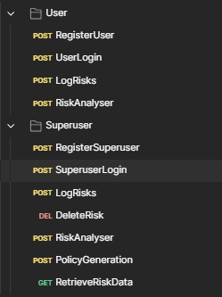

# How to use the SOFTWARE

---

## Download repo
1. Clone or download the GitHub repository as per the instructions in the README.md.

---

## Setting Up Postman

### 1. Create a Postman Account
- Go to [https://www.postman.com/](https://www.postman.com/)
- Sign up or log in with your credentials.

### 2. Create a Collection
- Click **Collections** in the left sidebar.
- Click **New Collection** > Give it any name`.
- Create folders inside the collection: `User`, `Superuser`.
- Inside each folder, add the corresponding requests (see below).




### 3. Create an Environment
- Go to the **Environments** tab (gear icon top-right).
- Click **Add** and give it a name (E.g `LocalEnv`).
- Add the following variables:

| Variable | Value |
|----------|-------|
| host     | http://localhost: |
| PORT     | 8000 |
| token    | *(set automatically on login – see below)* |

> In your **Tests** tab of the `UserLogin` and `SuperuserLogin` request, paste the following code in scripts/post-response:
```javascript
let response = pm.response.json();
if (response.token) {
    pm.environment.set("token", response.token);
}
```
This ensures that the bearer token is stored automatically after login.


---

## Setting Up Requests

### FOR USERS

#### RegisterUser  
`POST {{host}}{{PORT}}/api/auth/register/user`
```json
{
  "name": "{{Full Name}}",
  "email": "{{Company/Personal email address}}",
  "password": "{{Personal Password}}",
  "postcode": "{{E.g g11 1yy}}",
  "organisationPassword": "{{password given by superuser}}",
  "companyName": "{{CompanyName}}"
}
```

#### UserLogin  
`POST {{host}}{{PORT}}/api/auth/login`
```json
{
  "email": "{{Email address}}",
  "password": "{{personal password}}"
}
```

- After sending, copy the token from the response and set it as the value for `token` in your environment.

#### LogRisks  
`POST {{host}}{{PORT}}/api/risks`  
Auth: Bearer Token (use `{{token}}`)
```json
{
  "title": "{{Risk Title/Name}}",
  "description": "{{A sentence to describe the concern of the risk occurring}}",
  "reportedBy": "{{FullName of employee}}",
  "organization": "{{Name of company}}"
}
```

#### RetrieveRiskData  
`GET {{host}}{{PORT}}/api/getrisk?organization={{Name of Organisation}}`  

or

`GET {{host}}{{PORT}}/api/getrisk?riskId={{"RiskIdNumber"}}`

or

`GET {{host}}{{PORT}}/api/getrisk?title={{Name of Title given to risk}}`

Auth: Bearer Token

#### RiskAnalyser  
`POST {{host}}{{PORT}}/api/risks/analyze`
```json
{
  "id": "{{Risk ID - retrieve from the database}}"
}
```


---

### FOR SUPERUSERS

#### RegisterSuperuser  
`POST {{host}}{{PORT}}/api/auth/register/superuser`
```json
{
  "name": "{{FullName}}",
  "email": "{{Email - Company or Personal}}",
  "password": "{{Password}}",
  "postcode": "{{Postcode: E.g h11 8ui}}",
  "companyName": "{{Name of Organisation}}"
}
```

#### SuperuserLogin  
`POST {{host}}{{PORT}}/api/auth/login`
```json
{
  "email": "{{Email address}}",
  "password": "{{Personal Password}}"
}
```

#### DeleteRisk  
`DELETE {{host}}{{PORT}}/api/risks/{{RiskID}}`  
Auth: Bearer Token

#### PolicyGeneration  
`POST {{host}}{{PORT}}/api/policy/policies`
```json
{
  "organization": "{{Company Name}}",
  "riskIds": [{{List of Risk IDs to be documented in the policy}}]
}
```
NOTE: Ensure that the riskIds submitted is in given in an array of strings.

E.g "riskIds": ["riskId_1", "riskId_2", "riskId_3"]

---

## Using the Requests

1. Go to the top-right corner under "Variables in request"
2. Fill in all required variables
3. Ensure `LocalEnv` is selected
4. Press **Send**
5. Copy the login token response and paste it into the environment

---

## Order of Use

### FOR SUPERUSERS
1. Register and log in  
2. Log a risk concern  
3. Retrieve risk  
4. Request risk analysis  
5. (Optional) Delete risks  
6. Generate policy  
7. Download policy (from local '/policies' directory)
8. (Optional) View organisation data on MongoDB database

### FOR USERS
1. Register and log in  
2. Log a risk concern  
3. Retrieve risk  
4. Request risk analysis

---

**END OF INSTRUCTION SHEET**

